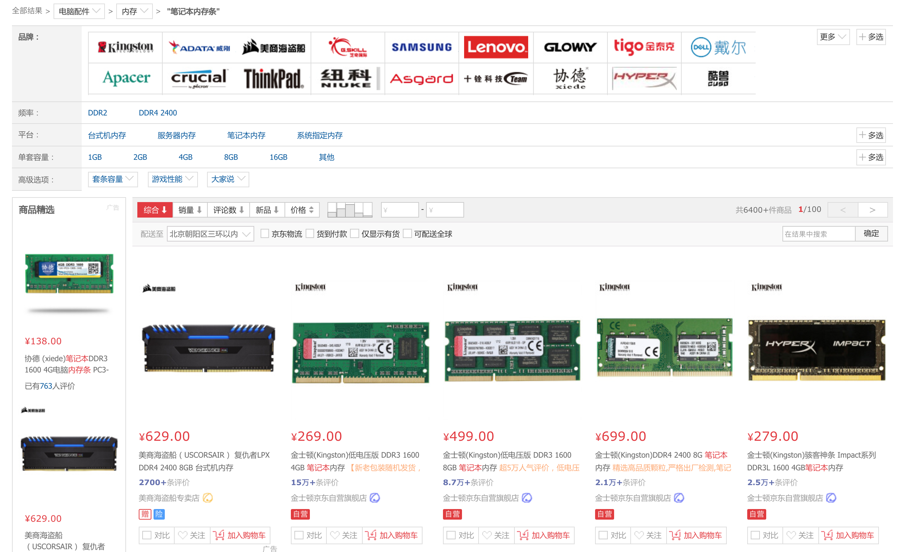
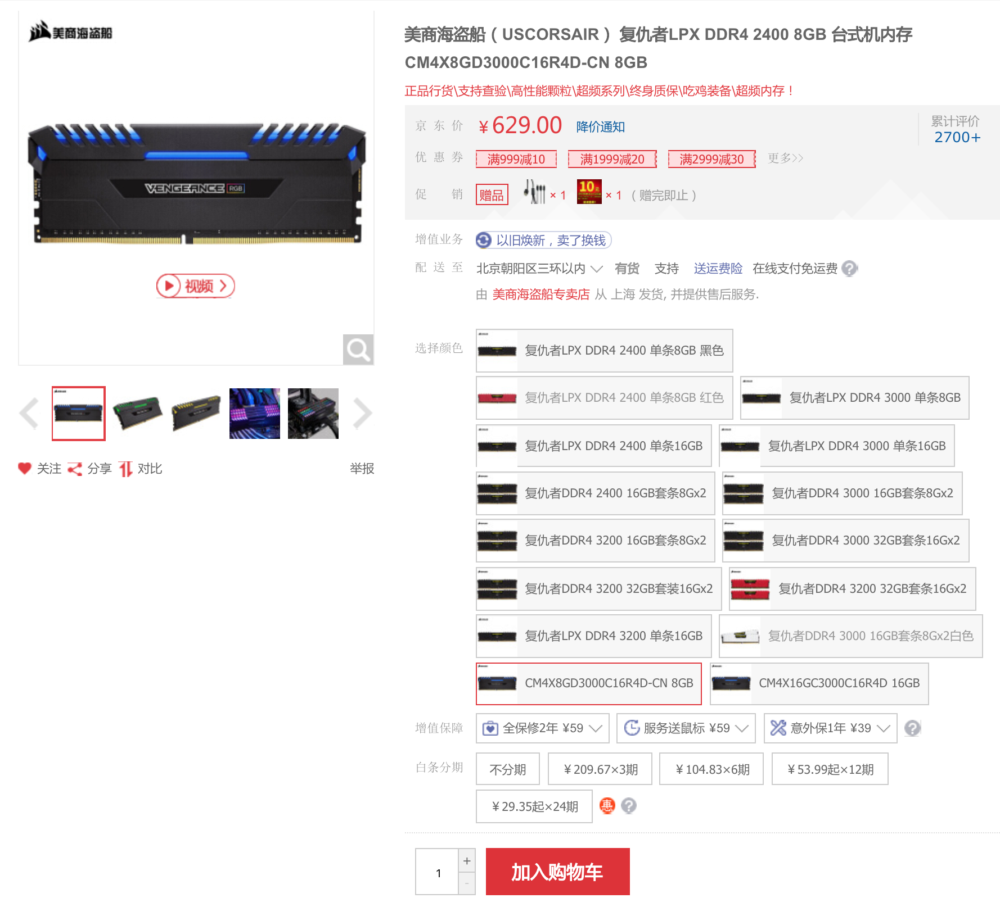
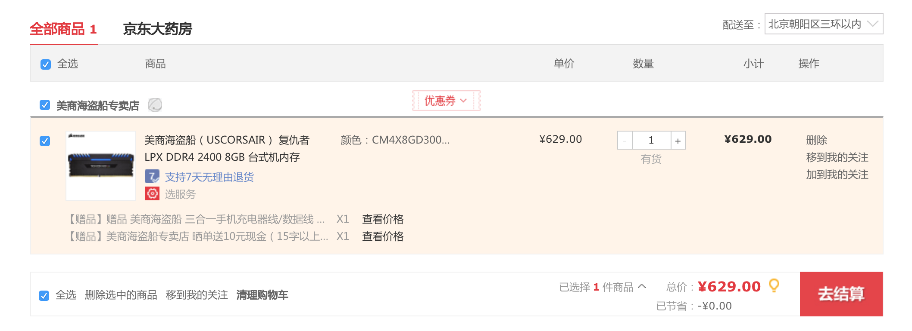
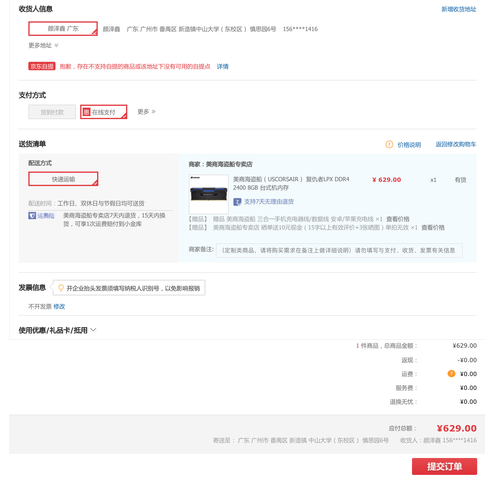
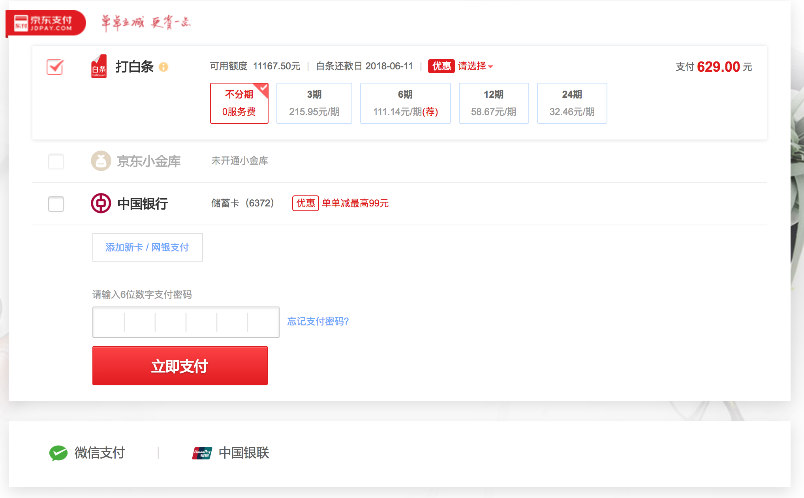

# 京东购物

## 问题描述

* 京东购物业务的用例图
* 京东购物业务的活动图
* 京东购物的领域模型
* 京东购物业务的状态图
* 京东购物业务的系统顺序图与操作协议

## 业务描述

**截图1** 表明了顾客可以输入所需物品的名称或则上传所需物品的照片来进行商品检索。顾客可以主动输入所需物品的名称也可以点击推荐物品来获得详细的物品介绍。

**截图2** 展示了成功搜索的结果：

* 品牌：搜索某个特定品牌的产品
* 产品属性：有针对性选择产品的属性以获取更好的搜索结果
* 排序：根据“综合”、“销量”、“评论数”、“是否为新品”和“价格”对商品列表进行排序
* 配送方式：根据是否为“京东物流”、“货到付款”、“仅显示有货”和“可配送全球”对商品列表进行过滤
* 搜索：在商品列表中进行搜索
* 商品列表：列举了一系列符合搜索要求的商品信息，包括商品价格、商品名称、商家名称和评价等

**截图3** 展示了一件商品详细信息。该页面提供了商品的图片介绍、价格、可用优惠券和可配送地等信息。客户还可以针对该商品选择特定的属性，包括颜色、规格等。另外，客户可选增值保障和是否使用白条分期。

**截图4** 展示了购物车界面。客户在选择完自己所需的商品后，就可以在购物车中进行选择是否进行结算。在购物车中可以查看已选商品的信息，另外客户可以改变购买商品的数量，还可以删除商品、移到我的关注和加到我的关注。该界面还会显示应付的总价。

**截图5**展示了账单的完成信息。客户可以修改收货人的信息，例如增加收货地址和修改收货地址等。客户可以选择支付方式。客户可以选择配送方式和配送的时间。并且，客户还可以查看所选商品的信息，以及应付总价。

**截图6** 展示的是付款界面。可以选择多种付款方式，包括打白条、使用京东小金库、银行卡和微信支付等方式。在输入支付密码之后就可以支付了。

